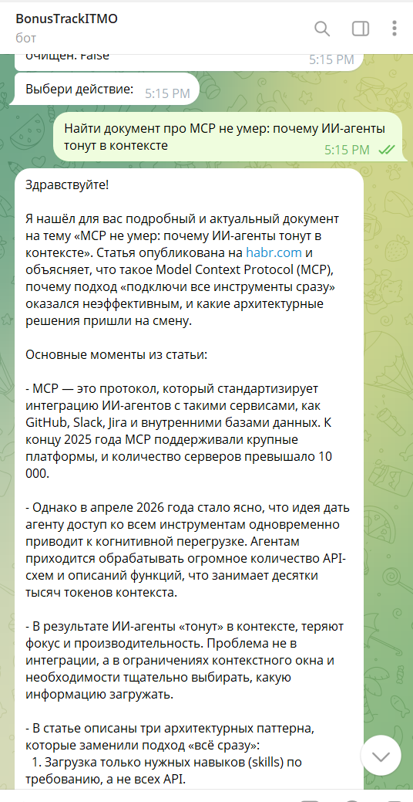
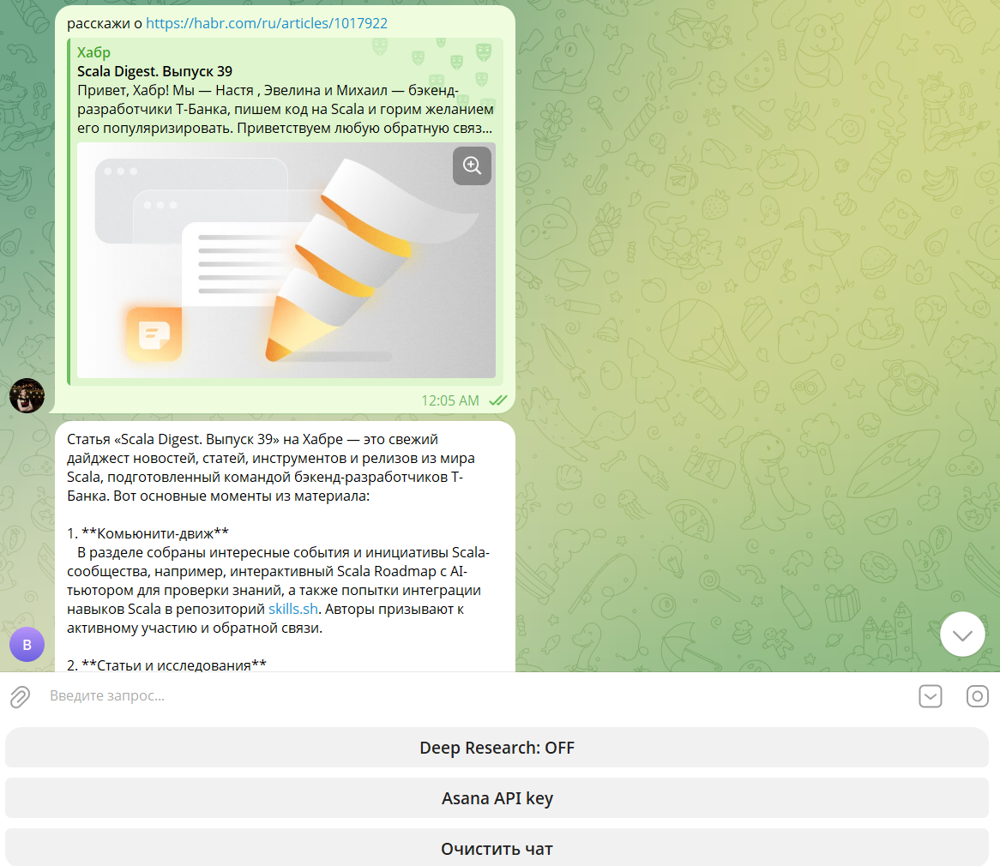
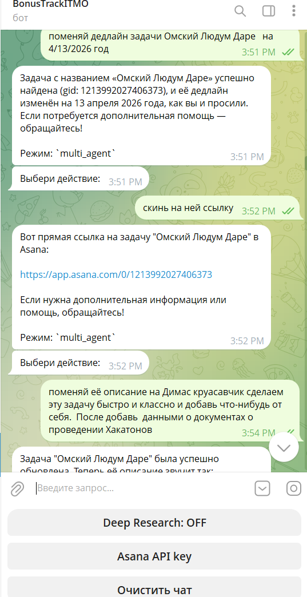
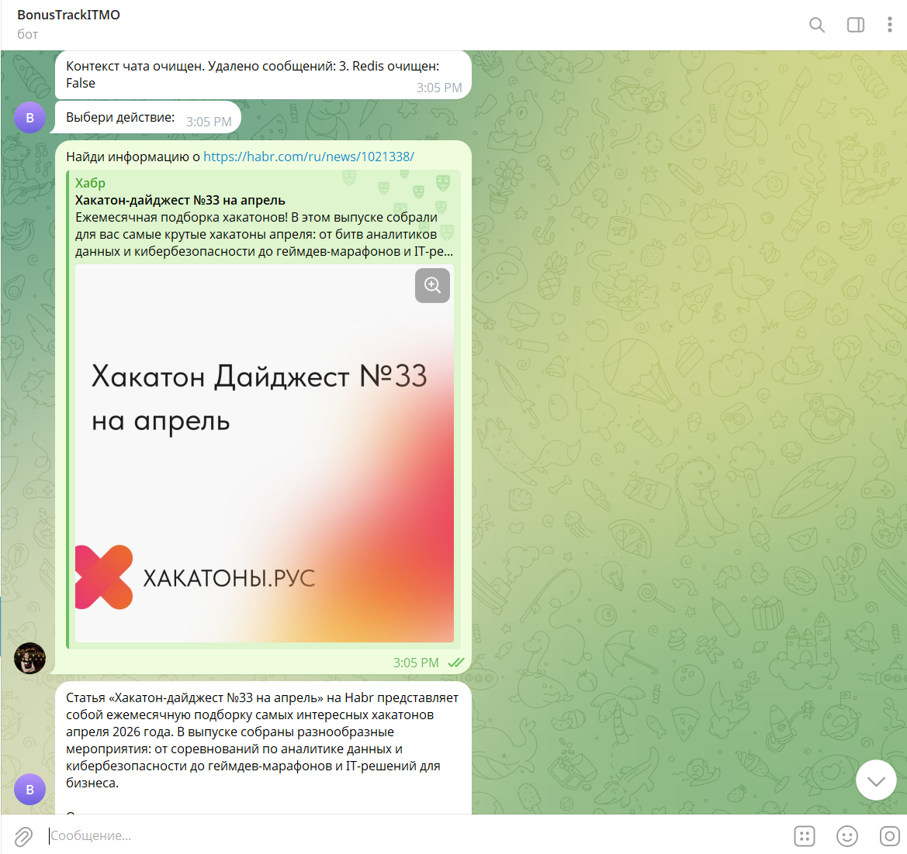
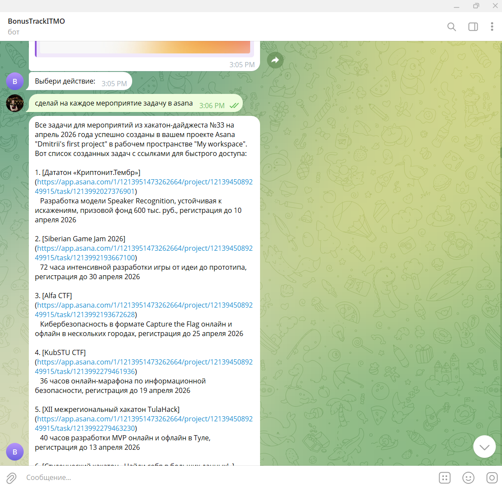
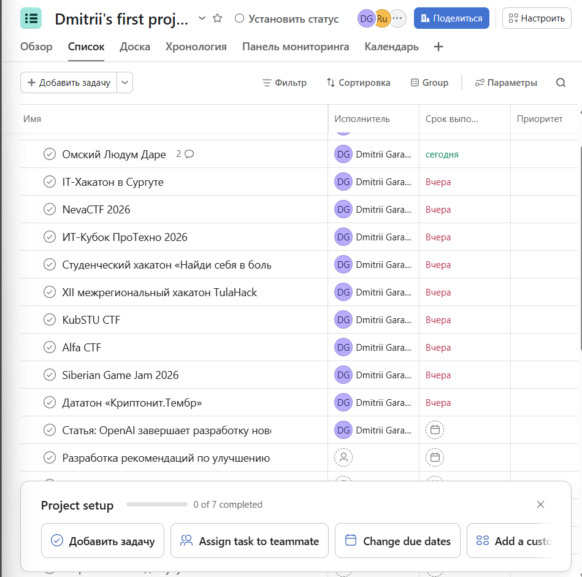

# Agent-Enhanced Corporate Search (RAG + Agents)

## Описание проекта

Проект направлен на создание чат поиска по внутренним артефактам условной компании (Confluence, Jira, кастомные документации и др.) с использованием RAG-архитектуры и агентов.

Целевая аудитория:
- разработчики
- аналитики
- продакт-менеджеры
- внутренние команды

### Текущая боль

- Данные распределены по множеству источников и людям приходиться тратить время на нахождение информации
- Сложные и длинные запросы имеют низкий recall в стандартном RAG workflow
- LLM может генерировать hallucinations
- Пользователи делают повторные уточняющие запросы
- Снижается доверие к системе при неточных ответах

Цель — повысить полноту и надежность ответов при сохранении приемлемой latency и стоимости.

---

## Что делает PoC на демо

- Чат поиск по нескольким источникам (Эмуляция вики документов, Jira задач, возможные разнобразные сорсы(типо Habr));
- Базовый RAG (baseline)
- Агентная логика:
  - декомпозиция сложного запроса;
  - multi-step retrieval;
  - верификация ответа;
  - NER для выявления объектов и уточнения информации о них;
  - Deep research.
- Сравнение baseline vs agent по:
  - Recall@k
  - MAP
  - nDCG
  - качество ответа (LLM-as-judge)
  - latency

---

## Out of Scope (Что НЕ делает PoC)

- Полноценная продакшен-интеграция;
- Полная система авторизации;
- Онлайн-обучение / RL;
- Полный governance-контур.

PoC будет исследовательский прототипом для проверки гипотезы, как агенты смогут обогатить стандартный RAG пайп

# Результаты

## Что было сделано

Были реализованы три сервиса:

* **Backend-сервис** с реализацией мультиагентной системы, инструментов (tools) и общих интеграций;
* **Retrieval-сервис** с реализацией векторного поиска, BM25 и гибридного поиска. В него были загружены, распарсены и разбиты на чанки статьи с Habr;
* **Telegram-бот** в качестве пользовательского интерфейса для взаимодействия с системой.

## Используемые базы данных

* **Redis** — для хранения краткосрочной памяти (short-term memory);
* **PostgreSQL** — для хранения долгосрочной памяти (long-term memory).

## Используемые технологии и подходы

* Агентная система (agent cycle) с планировщиком (planner), верификатором (verifier) и инструментами (tools);
* Логирование через **Langfuse**, где сохраняется различная информация о работе системы;
* Анонимизация логов;
* Система памяти для сохранения важной информации в контексте диалога;
* Бенчмарки для оценки качества системы (результаты сохраняются в Langfuse). Датасет был сгенерирован с помощью LLM;
* Сервис развернут на сервере.
* Asana как аналог JIRA
* Текущие метрки

## Примеры работы

Работа тулы поиска  
Работа тулы habr  
Работа тулов asana  
Работа нескольков тулов в одном запросе   

## Что не успел реализовать

* Deep research

## Ссылки

* Telegram-бот: @bonustrackitmobot

  * Для тестирования можно не указывать API-ключ — будет использован дефолтный;
  * В Langfuse доступны трейсы с полной информацией;
  * В Telegram можно очистить контекст (short-term / long-term memory).

* Asana: https://app.asana.com/1/1214050065343934/project/1214052063650684/list

* Langfuse: https://cloud.langfuse.com/project/cmnqaswx301nnad08lqczjvvj
