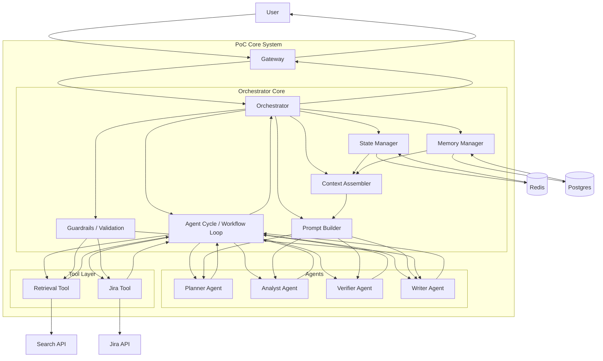

# C4 Component

# Пояснение
## Основные компоненты
* Gateway — принимает пользовательский запрос и передаёт его в ядро системы.
* Orchestrator — главный управляющий компонент, который координирует выполнение сценария.
* Agent Cycle / Workflow Loop — цикл исполнения, в рамках которого система:
* анализирует запрос,
* вызывает агентов,
* обращается к tool layer,
* обновляет state,
* принимает решение о следующем шаге,
* завершает выполнение финальным ответом.
## Агенты
* Planner Agent — извлекает сущности, определяет сложность, строит план.
* Analyst Agent — агрегирует найденные evidence и выделяет факты.
* Verifier Agent — проверяет groundedness, конфликты и достаточность данных.
* Writer Agent — формирует финальный ответ.
## Хранилища
* Redis — хранение runtime-state:
  - workflow state
  - visited queries 
  - промежуточные evidence 
  - текущий шаг цикла 
  - уточнения пользователя
* Postgres — хранение memory:
  - история переписки 
  - summaries 
  - session context 
  - пользовательский контекст
## Внешние контуры
* Search API — внешний поисковый контур / retrieval tool для поиска по документам.
* Jira API — внешний источник структурированных данных по задачам, статусам, исполнителям и связям между тикетами.
## Ключевая идея

Orchestrator не просто один раз вызывает агента, а управляет циклом исполнения, где после каждого шага:

* обновляется state,
* пересобирается context,
* проверяется необходимость новых retrieval/tool calls,
* принимается решение — продолжать цикл или формировать финальный ответ.