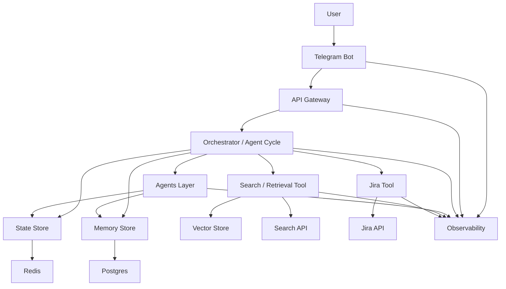

# C4 Container

# Пояснение (обновлённое)

### Frontend

- **Telegram Bot**
  - основной пользовательский интерфейс PoC
  - принимает текстовые запросы
  - может:
    - передавать флаг deep research mode
    - задавать уточняющие вопросы (clarification)
    - отображать ответ с источниками
  - выступает как lightweight frontend

---

### Backend

- **Gateway**
  - принимает запросы от Telegram-бота
  - добавляет metadata (user_id, session_id, flags)
  - передаёт в orchestrator

---

### Agents

- **Orchestrator / Agent Cycle**
  - управляет всей логикой выполнения
  - реализует цикл:
    - анализ
    - retrieval / tool calls
    - обновление state
    - принятие решения о следующем шаге
  - различает режимы:
    - standard
    - deep research
    - 
- planner — извлечение сущностей, планирование
- analyst — агрегация данных
- verifier — проверка качества
- writer — финальный ответ

---

### Поиск и инструменты

- **Search Tool**
  - поиск по документам (в PoC — Habr-like данные)
  - работает через Search API и Vector DB

- **Jira Tool**
  - единственный внешний API в PoC
  - используется для получения:
    - тикетов
    - статусов
    - исполнителей
    - связей

---

### Хранилища

- **Redis (State)**
  - текущий workflow
  - промежуточные результаты
  - шаги agent cycle

- **Postgres (Memory)**
  - история чата
  - summaries
  - пользовательский контекст

- **Vector Store**
  - embeddings
  - retrieval индекс

---

### Observability

Собирается со всех слоёв:
- Telegram Bot (user interaction)
- Gateway
- Orchestrator
- Agents
- Tools

---
