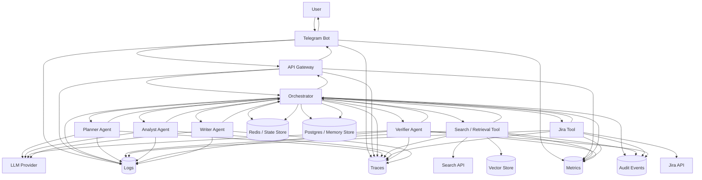

# Data Flow Diagram

## Пояснение

### 1. Поток пользовательских данных

1. Пользователь отправляет запрос через **Telegram Bot**
2. Telegram Bot передает запрос в **API Gateway**
3. Gateway:
   - валидирует запрос
   - добавляет технические метаданные (`request_id`, `session_id`, user info, deep_research flag)
4. Запрос передается в **Orchestrator**

---

### 2. Инициализация контекста

Перед выполнением Orchestrator читает данные из:

#### Redis (State Store)
- текущий workflow state
- промежуточные результаты
- visited queries
- текущий шаг выполнения
- retry counters
- история уточнений

#### Postgres (Memory Store)
- история переписки
- summary сессии
- пользовательский контекст
- предыдущие уточнения

---

### 3. Основной execution flow

#### 3.1 Planner step
Orchestrator вызывает Planner Agent (через LLM):

Вход:
- пользовательский запрос
- session context
- state

Выход:
- извлеченные сущности
- execution plan
- decomposition
- выбор режима (standard / deep research)

Результат сохраняется в state.

---

#### 3.2 Retrieval step
Orchestrator вызывает **Search / Retrieval Tool**:

Источники:
- Search API
- Vector Store

Выход:
- документы / chunk’и
- scores
- retrieval metadata

После этого:
- данные нормализуются в `evidence objects`
- сохраняются в state

---

#### 3.3 Jira step
Orchestrator вызывает **Jira Tool**:

Выход:
- тикеты
- статусы
- исполнители
- связи
- история изменений

После этого:
- данные приводятся к `evidence objects`
- добавляются в state

---

#### 3.4 Analysis step
Orchestrator вызывает Analyst Agent (LLM):

Выход:
- агрегированные факты
- противоречия
- пробелы в данных
- структурированная сводка

Результат сохраняется в state.

---

#### 3.5 Verification step
Orchestrator вызывает Verifier Agent (LLM):

Выход:
- groundedness
- наличие конфликтов
- свежесть данных
- достаточность информации

Результат:
- сохраняется в state
- логируется как audit event

Если проверка не пройдена:
- запускается дополнительный цикл поиска
- либо формируется ответ с неопределенностью

---

#### 3.6 Writing step
Orchestrator вызывает Writer Agent (LLM):

Выход:
- финальный ответ
- ссылки на источники
- пометки uncertainty
- объяснение ограничений

---

### 4. Сохранение данных

После завершения:

#### Redis (State)
- финальный workflow state
- intermediate results
- execution trace

#### Postgres (Memory)
- история диалога
- summary
- финальный ответ
- пользовательский контекст

---

### 5. Что хранится

#### State (Redis)
Краткоживущие данные:
- execution mode
- текущий шаг
- подзадачи
- visited queries
- evidence
- tool calls
- retry counters
- verification status

#### Memory (Postgres)
Долгоживущие данные:
- chat history
- summaries
- пользовательский контекст
- финальные ответы

#### Vector Store
- embeddings
- индекс документов

---

### 6. Что логируется

#### Logs
- входящий запрос
- шаги агентов
- tool calls
- ошибки
- fallback события

#### Metrics
- latency
- количество шагов
- token usage
- cost
- retrieval показатели
- verification ошибки

#### Traces
- полный путь запроса через систему
- отдельные этапы: planner, retrieval, Jira, verification, writer

#### Audit
- какие источники использовались
- какие tools вызывались
- почему был выбран deep research
- причины fallback
- причины uncertain ответа

---