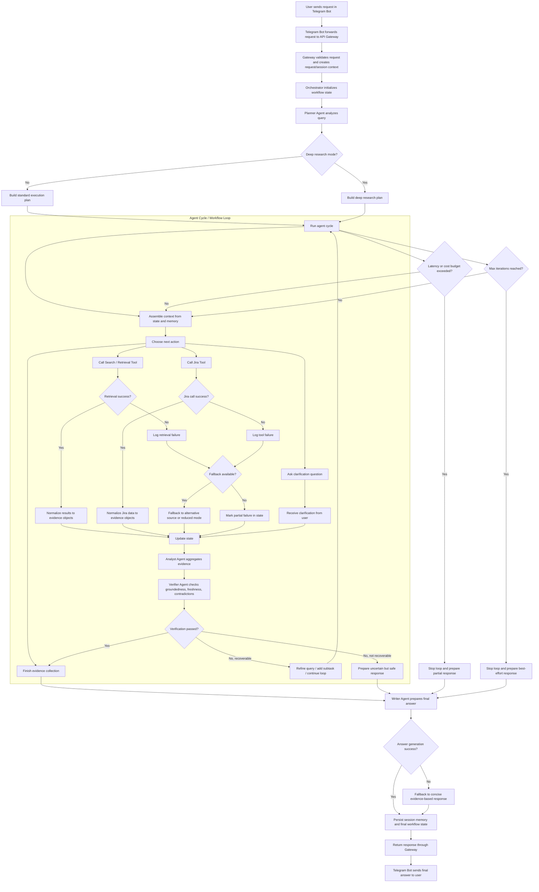

# Workflow / Graph Diagram

# Пояснение
## Основной поток
1. Пользователь отправляет запрос через Telegram Bot
2. Gateway валидирует запрос и создает request/session context
3. Orchestrator инициализирует/подгружает state
4. Planner Agent анализирует запрос и выбирает режим:
* standard
* deep research
5. Далее запускается agent cycle, в котором система:
* собирает контекст,
* выбирает следующее действие,
* вызывает поиск или Jira,
* обновляет state,
* агрегирует evidence,
* проверяет качество через verifier
## Ветки внутри цикла

Внутри цикла возможны следующие действия:

* вызов Search / Retrieval Tool
* вызов Jira Tool
* постановка clarification question
* завершение сбора evidence
## Ветки ошибок

Диаграмма покрывает основные ошибки:

* retrieval failure
* Jira API failure
* verification failure
* answer generation failure
* превышение latency/cost budget
* достижение max iterations

## Fallback-логика

При ошибках система не должна падать целиком. Возможные fallback-сценарии:

* переход к альтернативному источнику
* переход к reduced mode
* выдача partial answer
* выдача uncertain but safe response
* best-effort response на основе уже найденного evidence
