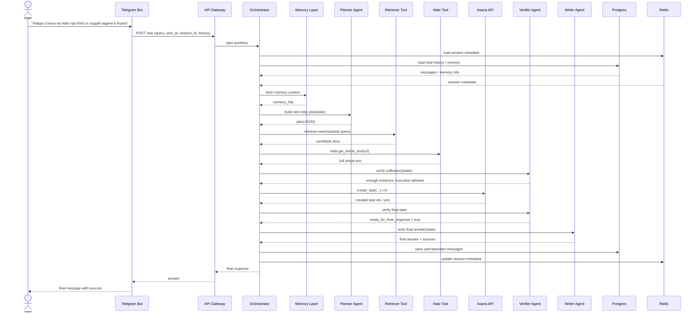

# Sequence Diagram

Документ описывает один end-to-end сценарий работы системы.

Сценарий:
**Пользователь в Telegram просит найти статью на Habr и создать по ней задачи в Asana.**

---

## Sequence Diagram

Пояснение к сценарию
1. Вход

Пользователь отправляет запрос в Telegram-бот.

2. Gateway

Gateway принимает запрос и передает его в orchestrator вместе с:

user_id
session_id
историей сообщений
параметрами режима
3. Memory / session loading

Orchestrator поднимает:

metadata из Redis
историю чата из Postgres
memory context из memory layer
4. Planning

Planner Agent анализирует текущее состояние и определяет:

какой article query использовать,
какие retrieval steps нужны,
нужны ли execution steps.
5. Retrieval

Orchestrator вызывает retriever и получает кандидатов документов.
Если релевантный Habr URL найден, отдельно загружается полный текст статьи.

6. Verification before execution

Verifier проверяет:

действительно ли статья найдена,
хватает ли контекста,
безопасно ли переходить к Asana execution.
7. Asana execution

Если evidence достаточен, orchestrator выполняет создание задач в Asana.

8. Final verification

После execution verifier повторно оценивает состояние и подтверждает, что можно писать финальный ответ.

9. Writing

Writer Agent формирует финальное сообщение для пользователя.

10. Persistence

История чата сохраняется в Postgres, metadata — в Redis.
